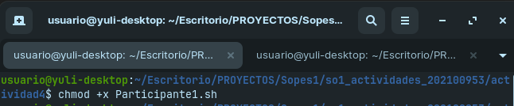
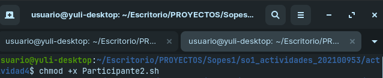
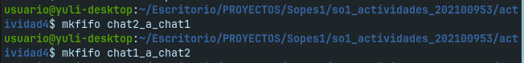
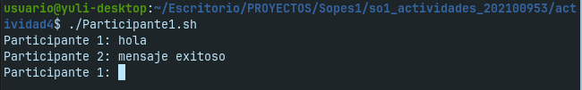
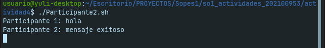

# CHAT DE MENSAJES

### Scripts

Para realizar el chat basico en el que puedan haber dos participantes, se debe de crear dos scripts para cada uno de ellos, en el cual se permita la lectuara del mensjae del usuario, luego que este se envie al otro participante, se espere la respuesta y por ultimo esta respuesta se muestre en el chat del primer participante.

Todo esto debe realizarse por medio de un ciclo a manera de permitir más iteracciones. Para ver el código revisar el script bash `Participante1.sh` y `Participante2.sh`.

### Ejecucion

Para que el chat sea funcional se debe realizar lo siguiente:

1. Entrar a la carpeta que contiene los scripts.

2. Nos aseguramos de dar los permisos de ejecucion a los script con `chmod +x`.

3. Crear los named pipes para establecer los canales de comunicacion entre los dos participantes para esto utilizamos el comando `mkfifo`.

4. ejecutamos los scripts en dos terminales separadas y hacemos pruebas.

